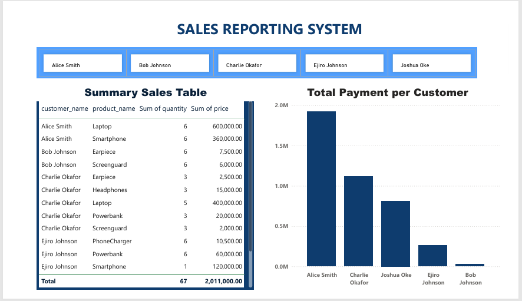

# Sales-Report-System

## Table of Content

- [Project Overview](#Project-Overview)
- [Data source](#Data-source)
- [Problem Statement](#Problem-Statement)
- [Tools used](#Tools-used)
- [Skills demonstrated](#Skills-demonstrated)
- [Data Analysis](#Data-Analysis)
- [Visualisations](#Visualisations)
- [Insights from analysis](#Insights-from-analysis)
- [Conclusion and Recommendations](#Conclusion-and-Recommendations)


## Project Overview

The Sales Reporting System is a database-driven reporting solution designed to combine data from multiple related tables to produce meaningful sales insights. By linking customer, product, and transaction datasets, this system helps identify who bought what, how much they spent, and overall sales trends which are essential in driving business growth.

This project demonstrates data analysis, SQL querying, and business intelligence skills while providing a reusable reporting framework for any sales-related business.

## Data source

The data was generated randomly drawing from real world scenario.

Example tables used:

1. Customers Table with the following fields:
customer_id (Primary Key), customer_name, email  

2. Products Table with the following fields:
product_id (Primary Key), product_name, price

3. Cus_Order Table with the following fields:
order_id, customer_id (Foreign Key), product_id (Foreign Key), quantity

## Problem Statement

In many businesses, organizations and government parastaltals, sales data is stored across multiple tables in a relational database. For example, customer records in one table, product details in another, and sales transactions in a third. This structure supports efficient data storage, however, it poses the challenge of generating quick, insightful reports.

Managers and analysts often face difficulties answering questions like:

- *Which products are our top sellers by revenue?*

- *Which customers contribute most to total sales?*

- *How much has each customer spent over a period?*

Without an automated and structured reporting system, retrieving this information can be time-consuming, error-prone, and inefficient.
The Sales Reporting System addresses this gap by combining related tables through SQL queries and producing clear, concise, and accurate reports that can support data-driven decision-making.


## Tools used

- PostgreSQL – For database storage and querying.

- SQL - For querying the database

- Power BI – For creating interactive dashboards (optional extension).

- GitHub – For version control and project documentation.
  
## Skills demonstrated

-Relational database design & normalization

-Writing complex SQL queries with joins

-Aggregation & grouping of sales data

-Creating views

-Connecting SQL report from database to Power Bi 

-Business intelligence reporting

-Data visualization best practices

-Markdown language

## Data Analysis

A. Database Setup – Create and populate customers, products, and transactions tables.
### Create tables:
Customer, Product and cus_order  

```sql
Create Table Customer (
customer_id SERIAL PRIMARY KEY, 
    customer_name VARCHAR(100)not null, 
    email VARCHAR(100) not null
);
     Create Table Product (
 product_id SERIAL PRIMARY KEY, 
    product_name VARCHAR(100), 
    price NUMERIC 
);

create table cus_order(
 order_id SERIAL PRIMARY KEY, 
    customer_id INT REFERENCES customer(customer_id), 
    product_id INT REFERENCES product(product_id), 
    quantity INT 
);
```

### Insert values into tables:
Customer, Product and cus_order

```sql
INSERT INTO Customer (customer_name, email) 
VALUES ('Alice Smith', 'alice@gmail.com'), 
('Bob Johnson', 'bob@gmail.com'), 
('Ejiro Johnson', 'ejiro@gmail.com'),
('Joshua Oke', 'joshua@gmail.com'),
('Charlie Okafor', 'charlie@gmail.com');

INSERT INTO product (product_name, price)
VALUES 
    ('Laptop', 200000), 
    ('Smartphone', 120000),
    ('Earpiece', 2500),
    ('Screenguard', 2000),
    ('PhoneCharger', 3500),
    ('Powerbank', 20000),
    ('Headphones', 15000);

INSERT INTO cus_order (customer_id, product_id, quantity)
	VALUES (1, 1, 1),  -- Alice bought 1 Laptop 
           (1, 1, 2),  -- Alice bought 2 Smartphones 
           (1, 1, 3),
		   (1, 2, 1),
		   (1, 2, 2),
		   (1, 2, 3),
		   (1, 3, 1 ),
		   (1, 3, 2),
		   (1, 3, 3),
		   (2, 1, 1),
		   (2, 1, 2),
		   (2, 1, 3),
		   (2, 2, 1),
		   (2, 2, 2),
		   (2, 2, 3),
		   (2, 3, 1),
		   (2, 3, 2),
		   (2, 3, 3),
		   (3, 1, 1),
		   (3, 1, 2),
		   (3, 1, 3),
		   (3, 2, 1),
		   (3, 2, 2),
		   (3, 2, 3),
		   (3, 3, 1),
		   (3, 1, 2),
		   (3, 3, 3),
		   (2, 3, 3),
		   (2, 1, 3),
		   (2, 1, 3),
		   (1, 3, 3),
		   (2, 3, 3),
		   (2, 1, 3),
		   (2, 3, 3),
       (3, 2, 1);  -- Charlie bought 1 Smartphone

```


B. SQL Querying – Use joins and aggregations to combine datasets.

###  Show each customer's name and the product they bought 

```sql

select distinct customer_name, product_name
		   from customer
		   inner join cus_order
		   on customer.customer_id = cus_order.customer_id
		   inner join product
		   on product.product_id = cus_order.product_id
```
### Add quantity and total cost per order 
```sql
select customer_name, 
 product_name,
 quantity, 
 price,
    (cus_order.quantity * product.price) AS total_cost
		   from customer
		   inner join cus_order
		   on customer.customer_id = cus_order.customer_id
		   inner join product
		   on product.product_id = cus_order.product_id
		   group by customer_name, product_name, cus_order.quantity,product.price
		   order by customer_name desc;
```
### Total spending per customer 
```sql
select customer_name, sum(total_cost) as total_payment
		   from combined_table
		   group by customer_name
		   order by sum(total_cost) desc;
```
### Creating views
- combined_table
```sql

create view combined_table as
select customer_name, 
 product_name,
 quantity, 
 price,
    (cus_order.quantity * product.price) AS total_cost
		   from customer
		   inner join cus_order
		   on customer.customer_id = cus_order.customer_id
		   inner join product
		   on product.product_id = cus_order.product_id
		   group by customer_name, product_name, cus_order.quantity,product.price
		   order by customer_name desc;
```
- total spending per customer
```sql
       create view combined_table_total_cost as
		   select customer_name, sum(total_cost) as total_payment
		   from combined_table
		   group by customer_name
		   order by sum(total_cost) desc;
```

## Visualisations




## Insights from analysis

- High-Value Customers Drive Revenue – Alice Smith is the top customer with nearly ₦2M in sales, followed by Charlie Okafor with ₦1.1M. Bob Johnson records the lowest spend at approximately ₦6,000.

- Distinct Product Preferences – Alice Smith focuses on high-value purchases such as laptops and smartphones. Charlie Okafor shows a diversified buying pattern, including laptops, headphones, and powerbanks. Joshua Oke primarily purchases headphones and smartphones.

- Revenue Concentration Risk – A small number of customers generate the bulk of total sales, creating dependency risks if their purchasing patterns decline.

- Key Revenue Drivers – High-ticket products like laptops and smartphones account for most sales revenue, while lower-priced accessories contribute less despite selling in smaller quantities.


## Conclusion and Recommendations

This project successfully demonstrated how relational data from multiple tables can be integrated to produce actionable sales insights as well as reveal clear patterns in customer spending, product performance, and revenue distribution. The findings support data-driven strategies for customer retention, targeted marketing, and inventory optimization.

The following are my recommendations:

- Retain Top Customers – Introduce loyalty programs, exclusive offers, and early product access for high-value customers (e.g., Alice Smith, Charlie Okafor).

- Boost Low Spender Engagement – Use targeted promotions and bundled offers to increase purchases from low-spending customers (e.g., Bob Johnson).

- Maximize Upsell & Cross-Sell – Offer complementary products (e.g., accessories with laptops and smartphones) to high-spending customers.

- Broaden Customer Base – Implement acquisition strategies to reduce dependence on a small number of high spenders.

- Optimize Inventory – Maintain adequate stock of high-demand, high-value products while promoting accessories as add-ons to increase average order value.

- Enhance Reporting Capabilities – Incorporate date filters for flexible analysis and integrate predictive sales forecasting for proactive decision-making.


### Back to top 
###### [Table of Content](#Table-of-Content)
